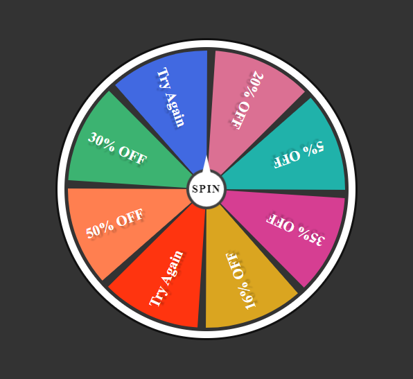

# Prize Winning Wheel

This is a Prize Winning Wheel application built with HTML, CSS, and JavaScript. It simulates a spinning wheel with different prize amounts. Users can spin the wheel and potentially win discounts or special offers.


## Getting Started

Clone the repository:

```bash
  git clone https://github.com/DeepakKumarVermaRamgarh/SpinWheelProject.git

```

- Open the project folder.

- Open the `index.html` file in a web browser.
    
## Features

The "Prize Winning Wheel" application provides a visual representation of a spinning wheel with various prize amounts. Each section of the wheel represents a different prize. Users can click the "Spin" button to start the spinning animation. When the wheel stops spinning, it randomly selects a prize for the user.

## Usage/Examples

- Open the "Prize Winning Wheel" application in a web browser.

- Click the "Spin" button to start spinning the wheel.

- Wait for the wheel to stop spinning.

- If the wheel lands on a prize, a coupon code will be displayed on the screen.

- Click the "COPY CODE" button to copy the coupon code to the clipboard.

- Use the copied coupon code for availing discounts or special offers.

## Roadmap

Here is a brief overview of each file in the repository:

- index.html - This file contains the HTML code for the project.

- styles.css - This file contains the CSS code that styles the project.

- script.js - This file contains the JavaScript code.

- README.md - This file provides instructions on how to run the project.
## Authors

This project was created by Deepak Kumar Verma.
- [@DeepakKumarVermaRamgarh](https://github.com/DeepakKumarVermaRamgarh/)


## Screenshots


